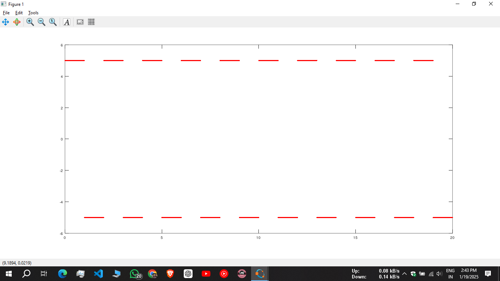

# Octave Code

## Basic : Code1 to Code17

---

## Graph :

**Code 18 :  Plot the function given of y =sin(x) where 0<x<2*pi considering 30 points between 0 and 2*pi**


---

**Code 19 : plot more than one curve sin(x) and cos(x) on the same plot**


---

**Code 20 : plot sinx cosx on the same plot using a color, marker and a line style**


---

**Code 21 : plot sinx cosx on the same plot using grid, lines, labels**


---

**Code 22 : plot sinx cosx on the same plot using hold on command**


---

**Code 23 : plot sinx, cosx, 2*sinx*cosx, sinx/cosx in one window using subplot command**


---

**Code 24 : Discrete time signal plot using octave (i) unit impulse signal (ii) unit step (iii) Ramp (iv) Parabolic Signal**


---

**Code 25 : In octave plot a square wave of amplitude 5 and -5 unit using for loop**



---

**Code 26 : Find linear convolution of**


---

**Code 27 : Find linear convolution of two user input sequence using 'conv' function, also plot the given sequence and convolute sequence**


---

**Code 31 : Write octave program to find 4 and 8 point DFT**

```
Command Window
Enter length : 4
z =

   3.0000-0i     0-1.0000i   1.0000 + 0.0000i  -0.0000 + 1.0000i


```

* **4 Point :**
  
* **8 Point :**
  

---

**Code 32 : IDFT (Inverse DFT) Without using built-in functions**

```
Command Window
Enter the Sequence: [12, -4+4j, -4, -4-4j]
Enter the length of DFT, N: 4

Reconstructed Sequence X(n):
   0   2   4   6

```

* **8 Point :**
  
* **50 Point :**
  

---

**Code 33 :  Circular Convolution Program Without using built-in functions**

```
Enter the 1st Sequence: [1,2,3,4]
Enter the 2nd Sequence: [1,1,1,1]
Circular Convolution Result:
   10   10   10   10

```


---

**Code 34 :  User Input DFT Without using built-in functions**

```

Command Window
Enter the length of DFT (N): 4
Enter the sequence X[n]: [0,2,4,6]
DFT Result Z[k]:
   12.0000+0i   -4.0000+4.0000i   -4.0000-0.0000i   -4.0000-4.0000i

```

---

### Yt Video : [Circular Convolution Using Code Composer Studio | DSP](https://youtu.be/emy8eHnrNjQ?si=Irl0b5x8LwXfR2Oz)

## Best Of Luck 🤗 🎉
